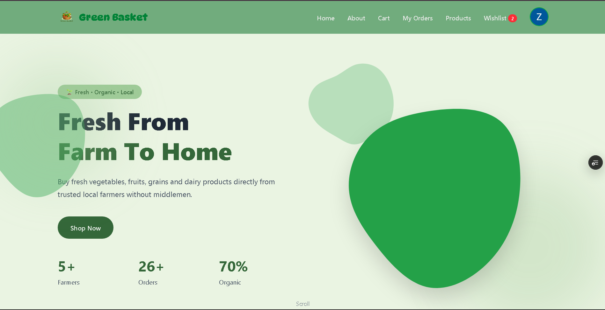
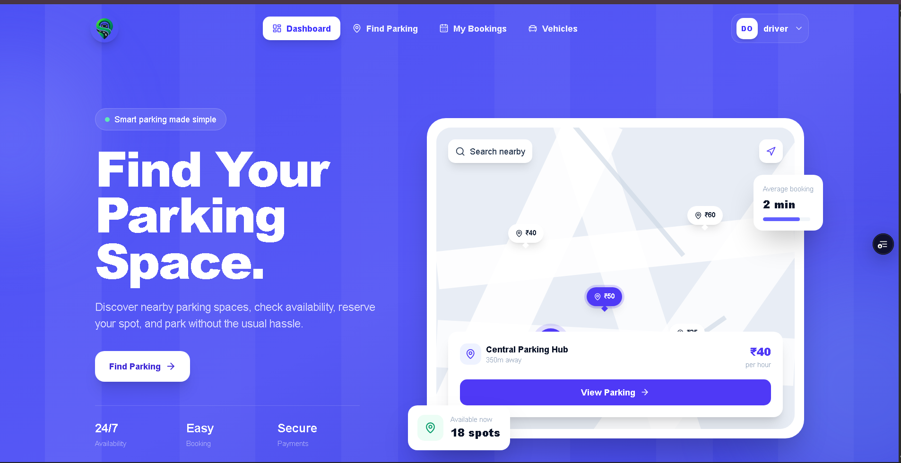

  

<h3>Full-Stack Developer from India 🇮🇳</h3>

I build modern and scalable web applications with a focus on interactive UI/UX, 
smooth animations, clean architecture, and great user experiences.

 

  

---

<table width="100%">
<tr>

<td width="50%" valign="top">

<h2>🧑‍💻 ABOUT ME</h2>

I'm <strong>Jyoti Ranjan Sahoo</strong>, a full-stack developer from India.

Currently pursuing my <strong>Master of Computer Applications</strong>. I enjoy building modern web applications, solving real-world problems, and creating interactive user experiences.

I have experience working on full-stack applications and continuously improve my development skills.

 

👤 <strong>Name:</strong> Jyoti Ranjan Sahoo

🎓 <strong>Education:</strong> MCA (2025 – Present)

📍 <strong>Location:</strong> Bhubaneswar, Odisha, India

💻 <strong>Role:</strong> Full-Stack Developer

🔥 <strong>Focus:</strong> MERN Stack & Next.js

🎨 <strong>Passion:</strong> Interactive UI/UX & GSAP

☕ <strong>Fuel:</strong> Coffee + Better Code

</td>

<td width="50%" valign="top" align="center">

<h2>⚙️ TECH STACK</h2>

<h3>🌐 Frontend</h3>

<h3>⚙️ Backend</h3>

<h3>🛠️ Tools</h3>

</td>

</tr>
</table>

---

<h1>🚀 FEATURED PROJECTS</h1>

<table width="100%">
<tr>

<td width="50%" align="center" valign="top">

<h2>🌱 GreenBasket</h2>

<h3>Agriculture Marketplace Platform</h3>

  

A modern agriculture marketplace platform connecting users with a smooth and user-friendly shopping experience.

  

  

</td>

<td width="50%" align="center" valign="top">

<h2>🚗 SlotGo</h2>

<h3>Vehicle & Slot Management Platform</h3>

  

A web platform focused on vehicle and slot management with a modern and interactive user experience.

  

  

</td>

</tr>
</table>

---

<h1 align="center">🔥 GITHUB STREAK</h1>

---

<table width="100%">
<tr>

<td width="50%" valign="top">

<h2>💼 EXPERIENCE</h2>

<h3>💻 Web Development Specialist</h3>

<strong>Tetra Trion Technologies Pvt. Ltd.</strong>

📍 Bhubaneswar

<ul>
<li>Built full-stack e-commerce applications</li>
<li>Developed responsive user interfaces</li>
<li>Created reusable UI components</li>
<li>Built cart and checkout experiences</li>
<li>Designed REST APIs</li>
<li>Worked with authentication and protected routes</li>
<li>Integrated MongoDB databases</li>
<li>Implemented error handling and logging</li>
<li>Worked with deployment and environment configuration</li>
</ul>

</td>

<td width="50%" valign="top">

<h2>🎓 EDUCATION</h2>

<h3>🎓 Master of Computer Applications</h3>

<strong>Gandhi Institute of Technology and Management</strong>

📅 2025 – Present

  

<h3>🎓 Bachelor of Computer Applications</h3>

<strong>IBMT Bhubaneswar</strong>

📅 2022 – 2025

  

<h3>🎓 Bachelor of Science</h3>

<strong>Rajdhani science College, Bhubaneswar</strong>

📅 2020 – 2022

</td>

</tr>
</table>

---

<h1 align="center">🐍 CONTRIBUTION SNAKE</h1>

---

<h1 align="center">🏆 GITHUB ACHIEVEMENTS</h1>

  

  

  

---
<h1 align="center">🤝 CONNECT WITH ME</h1>

  

  

<h3>⭐ Thanks for visiting my profile!</h3>

